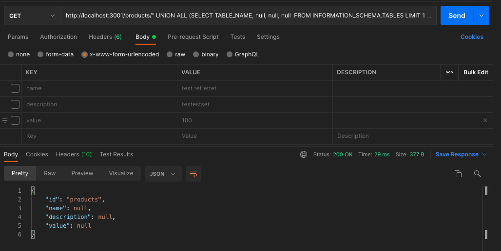
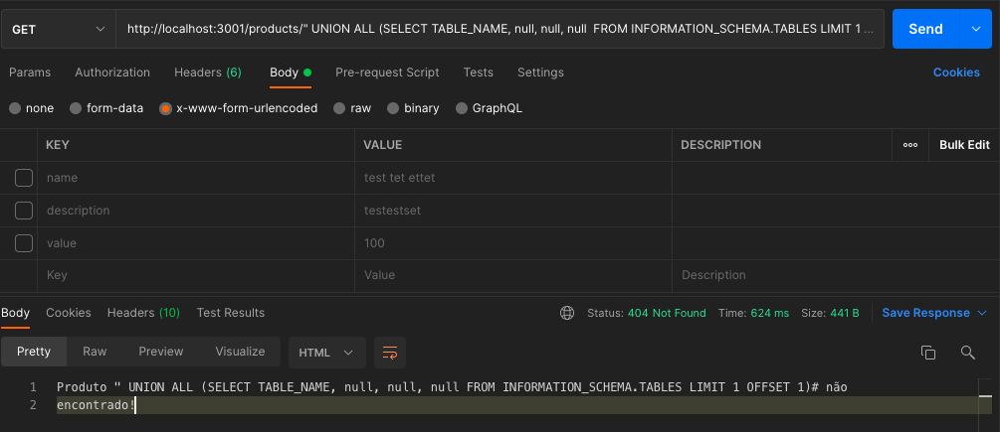

# Projeto Final

1. Web App Angular (Frontend): http://localhost:4200;
2. API Orquestradora (Backend For Frontend): http://localhost:3000;
3. API Produto de pedidos (orders): http://localhost:3001;
4. API Produto de produtos (products): http://localhost:3002;
5. Banco de dados: localhost:3306;

# Sql Inject 
- antes:

- depois:

- [Folha de dicas de injeção de SQL](https://www.netsparker.com/blog/web-security/sql-injection-cheat-sheet/)
- [SQL injection](https://portswigger.net/web-security/sql-injection)
